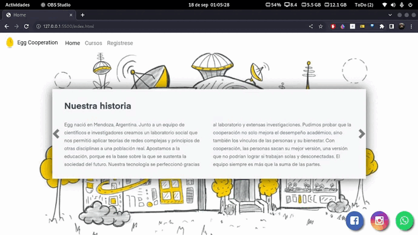

<h2> Landing Page Egg Cooperation</h2>

## Este sitio está construido con:

## Para las alertas, iconos y carga de la pagina use:

## [SweetAlert](https://sweetalert.js.org/guides/)
## [Animated Css](https://animate.style/)
## [Jquery FadeIn](https://api.jquery.com/fadein/)

